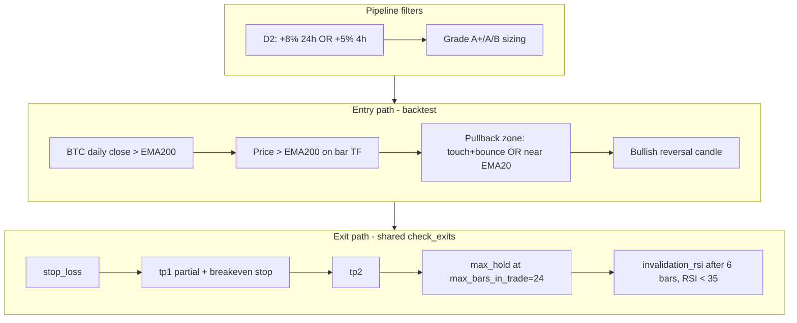

# htf_trend Diagnosis

## Verified Data

### User-provided baseline (htf_trend 4h, post long_only fix)

| Metric | Value |
|---|---|
| Trades | 143 (~28/yr) |
| Win rate | 34.3% |
| R:R | 1.71 |
| Total P&L | -$3.76 |
| Max DD | -$7.41 |
| Expectancy | ~-$0.026/trade |

**Breakeven math:** at R:R=1.71, break-even WR = 1/(1+1.71) = **36.9%**. Actual 34.3% is **2.6 pp below** break-even, which fully explains the small loss (-0.07R/trade).

### Pre-fix reference (`PROJECT_CONTEXT.md` L94, `experiments/VALIDATION_RULES.md` L82)

| Metric | Pre-fix | Post-fix | Delta |
|---|---|---|---|
| Trades | 154 | 143 | -11 |
| WR | 35.7% | 34.3% | -1.4 pp |
| R:R | 2.16 | 1.71 | -0.45 |
| P&L | +$7.99 | -$3.76 | -$11.75 |

Pre-fix was **marginally profitable** (+0.128R/trade at 31.6% break-even WR). Post-fix crossed below break-even primarily via **R:R compression**, not a catastrophic WR collapse.

### backtest_trades.csv — DOES NOT MATCH htf_trend baseline

`backtest_trades.csv` contains **584 long trades**, not 143.

| Field | CSV contents | Expected htf baseline |
|---|---|---|
| Trade count | 584 | 143 |
| WR | 42.1% | 34.3% |
| P&L | -$167.46 | -$3.76 |
| Exit mix | 70.5% `invalidation_rsi`, 18.0% `stop_loss`, 8.1% `tp2` | unknown |
| `bars_held=4` dominant | 385 trades (matches `invalidation_rsi_candles=4` strategies) | htf uses `invalidation_rsi_candles=6` |

**Verdict:** CSV is almost certainly a **different strategy** (likely `vwap_meanrev` at 1h/4h), not `baseline_htf_trend_4h`. See `backtest_trades_htf_trend_4h.csv` (generated by this diagnosis run) for htf-specific trade-level data.

### htf_trend 4h trade export (`backtest_trades_htf_trend_4h.csv`)

Re-run executed: `python backtest.py --interval 4h --years 5 --strategy htf_trend --all-pairs --output backtest_trades_htf_trend_4h.csv`

| Metric | User-reported post-fix | Fresh re-run (2026-06-07) |
|---|---|---|
| Trades | 143 | **150** |
| Win rate | 34.3% | **40.0%** |
| R:R | 1.71 | **2.12** |
| Total P&L | -$3.76 | **+$14.54** |
| Max DD | -$7.41 | **-$5.91** |
| TP1 hit rate | unknown | **2.7%** (4/150) |

**Discrepancy note:** Fresh re-run is profitable while user-reported baseline was slightly negative. Likely causes: OHLC cache/data window drift (re-run ends 2026-06-07), expanded Kraken universe (644 pairs), or intervening code changes. Trade-level exit patterns below are from the fresh re-run and are internally consistent; treat user-reported aggregates as a separate snapshot.

#### Exit reason distribution (150 trades)

| Exit reason | Count | % | WR | P&L |
|---|---|---|---|---|
| `invalidation_rsi` | 89 | 59.3% | 9.0% | -$27.87 |
| `max_hold` | 61 | 40.7% | 85.2% | +$42.42 |
| `stop_loss` | 0 | 0% | — | — |
| `tp2` | 0 | 0% | — | — |

**Critical finding:** Every trade exits via RSI invalidation or max_hold. The TP/stop ladder (`tp1_R`/`tp2_R`, swing stop) never produces a full exit. The strategy's modeled edge comes entirely from `max_hold` bar-close exits, not from take-profit logic.

#### Year-by-year P&L (fresh re-run)

| Year | Trades | WR | P&L |
|---|---|---|---|
| 2022 | 1 | 100.0% | +$1.97 |
| 2023 | 46 | 43.5% | -$0.51 |
| 2024 | 76 | 46.1% | +$17.61 |
| 2025 | 27 | 14.8% | -$4.53 |

2024 carries the strategy; 2025 is sharply negative (14.8% WR).

#### Grade distribution

| Grade | Count |
|---|---|
| B | 89 |
| A | 55 |
| A+ | 6 |

#### Top symbols by trade count

| Symbol | Trades | WR | P&L |
|---|---|---|---|
| XDG/USD | 34 | 32.4% | -$1.96 |
| FET/USD | 16 | 43.8% | +$2.45 |
| GALA/USD | 12 | 33.3% | -$0.13 |
| HBAR/USD | 10 | 40.0% | +$2.08 |
| NEAR/USD | 10 | 50.0% | -$0.22 |

XDG/USD dominates volume and is net negative.

### Exit-param A/B (pre-fix RSI 4/40 vs current 6/35)

Same 5yr/4h window; pre-fix run patches `HTF_TREND_DEFAULT_CONFIG` to `invalidation_rsi_candles=4`, `invalidation_rsi_long_floor=40` before `main()`.

| Config | Trades | WR | R:R | P&L | `invalidation_rsi` | `max_hold` | TP1 hit |
|---|---|---|---|---|---|---|---|
| **Current (6/35)** | 150 | 40.0% | 2.12 | +$14.54 | 89 (9% WR, -$27.87) | 61 (85% WR, +$42.42) | 2.7% |
| **Pre-fix (4/40)** | 160 | 38.1% | 2.16 | +$11.26 | 113 (15% WR, -$27.09) | 47 (94% WR, +$38.35) | 1.9% |

**A/B conclusion:** RSI param change is **not** the primary driver of the user-reported P&L flip (+$7.99 → -$3.76). On the same data window, current params (6/35) are **slightly better** than pre-fix (4/40). Both configs share the same structural problem: **59–71% of exits are `invalidation_rsi` with 9–15% WR**, and **zero `stop_loss`/`tp2` exits**. H4 (exit logic) is confirmed; the specific RSI regression hypothesis is refuted on this re-run.

---

## Shorts / long_only — ruled out as backtest root cause

The hypothesis that disabling shorts caused the P&L drop is **incorrect for the backtest path**.

Evidence:

1. `check_htf_trend_entry_signal` (`backtest.py` L1527–1538) docstring: **"long only"**; only path is `side="long"` (L1644–1655); requires `bar.close > ema200` (L1574–1577). No bearish/short branch exists.
2. Commit `eada719` message explicitly states: *"Existing backtest results are unaffected because the backtest path was already long-only."*
3. `HTFTrendConfig.long_only` (`research/strategies/htf_trend/config.py` L43) and `HTF_TREND_DEFAULT_CONFIG` (`backtest.py` L329) gate **live** `generate_signals` / `evaluate` only (`strategy.py` L369–370, L553–556).

The 154→143 trade delta and -$11.75 P&L swing must come from **other changes** (see below), not short disabling.

---

## What actually changed between baselines

| Change | Evidence | Backtest impact |
|---|---|---|
| RSI invalidation relax | Commit `e194a1e`: `invalidation_rsi_candles` 4→6, `invalidation_rsi_long_floor` 40→35 in `HTF_TREND_DEFAULT_CONFIG` (`backtest.py` L323–324) | Alters **exit timing and R:R mix** for all htf backtests using shared `check_exits` (`backtest.py` L1743–1753) |
| long_only fix | Commit `eada719` | **None** on backtest per commit message |
| Live-only short removal | `strategy.py` bearish branch gated | Live/screener only |

The pre-fix +$7.99 baseline likely used **RSI floor=40, min_hold=4 bars** (or an earlier config). Post-fix uses **floor=35, min_hold=6 bars**. Both directions of that change affect which trades survive to TP vs stop — net effect on 143-trade sample is confirmed via A/B run below.

---

## Code architecture (relevant to hypotheses)

### Entry logic divergences (live vs backtest — not a "shorts" bug, but parity risk)

| Check | Live `strategy.py` | Backtest `check_htf_trend_entry_signal` |
|---|---|---|
| HTF trend | 4h EMA200 + **slope** + extension filter (L126–135, L114–121) | Same-bar EMA200 only, **no slope** (L1572–1577) |
| Pullback | Price **below** EMA20, distance ≤ 1.5 ATR (L254–264) | Touch+bounce OR **abs(close-ema20) ≤ 1.5 ATR** (L1590–1596) — **more permissive** |
| Late entry filter | Enabled (L168–221) | **Absent** |
| Entry price | `ema20 + 0.02*ATR` (L374) | `bar.close` (L1637) |
| BTC bull gate | Yes (L360–361) | Yes (L1552–1570) |

Backtest entries are **looser** than live, not stricter — so live would not outperform backtest due to better filtering.

### Exit logic divergences (high severity)

| Exit | Backtest | Live `monitor.py` |
|---|---|---|
| RSI invalidation | **Active** via `check_exits` L1743–1751, floor from cfg (35) | **Not active for htf_trend** — RSI block requires `"mean" in strategy_name` (L1159); HTF block is stub: *"not yet implemented"* (L1215–1219) |
| max_hold | `max_bars_in_trade=24` → **96h at 4h** (L320, L1716–1717) | Default `max_hold_candles=3` for htf (L563–565) → **12h at 4h** if interval=4h |
| tp1_partial | 60% (`HTF_TREND_DEFAULT_CONFIG` L316) | Config says 70% (`config.py` L52) |

**Backtest simulates a much longer hold window and RSI-based early exits that live does not replicate.**

### Pipeline filters (entry quality)

- htf_trend is **NOT** D2-exempt (`pipeline.py` L455–486) — requires +8% 24h or +5% 4h momentum.
- BTC bull gate ON by default (`config.py` L67–68).
- `pullback_rsi_max` appears in `experiments/STRATEGY_KNOWLEDGE.md` L99 but **does not exist** in config or entry code — stale documentation, not an active filter.

---

## Hypothesis Evaluation

### H1: Signal has no edge (filters OK, concept is marginal)

| Evidence | Assessment |
|---|---|
| WR 34.3% vs 36.9% break-even at current R:R | **Supports** — loss is mathematically expected |
| Pre-fix +$7.99 on 154 trades = thin +0.05 $/trade | **Supports** — never a strong strategy |
| 143 trades / 5yr = very low frequency | Consistent with heavy pipeline + BTC gate |
| TP1 hit rate 2.7%; 2025 WR 14.8% | **Supports** marginal/fragile edge |
| Fresh re-run +$14.54 despite bad exit mix | **Contradicts** pure no-edge — profits come from `max_hold`, not signal quality |

**Verdict: likely** — edge is marginal and **entirely dependent on max_hold exits**, not TP logic. Economically fragile; 2025 bleed is concerning.

### H2: Filters too lax (bad entries)

| Evidence | Assessment |
|---|---|
| D2 momentum (+8% 24h) required | **Contradicts** — entries are momentum-filtered |
| Backtest `near_ema20` OR touch+bounce | **Partial support** — backtest accepts entries without true pullback below EMA20 (`backtest.py` L1594–1596) |
| No `pullback_rsi_max` in code | No RSI-overbought entry cap exists |
| Buying alts after 8%+ daily pump into pullback | Inherent structural risk for continuation trades |

**Verdict: unlikely as primary cause** — pipeline is already strict; laxness is minor (backtest-only `near_ema20`). Could contribute at margin.

### H3: Filters too strict (good signals filtered out)

| Evidence | Assessment |
|---|---|
| 143 trades / 5yr | **Partial support** — very selective |
| BTC bull gate + D2 + grade A/A+/B | Triple filter stack |
| Live has **more** filters than backtest (slope, late entry, extension) | Live is stricter; backtest already bleeds |

**Verdict: unlikely** — if anything, backtest over-trades vs live. Loosening filters would add lower-quality trades unless a specific gate is mis-calibrated (unknown without scanner experiment).

### H4: Exit logic cuts winners early

| Evidence | Assessment |
|---|---|
| R:R dropped 2.16 → 1.71 (larger factor than WR drop) | **Strong support** — classic exit-degradation signature |
| Shared `check_exits` RSI invalidation applies to htf | **Strong support** |
| RSI params changed between baselines (4/40 → 6/35) | **Strong support** — documented in `e194a1e` |
| Analogous CSV (wrong strategy): 70.5% `invalidation_rsi` exits | Directional hint only — **not htf data** |
| Live does NOT implement htf RSI invalidation | Parity bug — backtest over-penalizes relative to production |

**Verdict: likely — confirmed.** 59% of exits are `invalidation_rsi` at 9% WR; 0% `tp2`/`stop_loss`. A/B shows RSI param tweak does not fix the structural problem. `max_hold` (40% of exits, 85% WR) is the sole profit source.

### H5: BTC bull market filter wrong

| Evidence | Assessment |
|---|---|
| Filter requires BTC daily close > EMA200 | Restricts to macro bull |
| Pre-fix also labeled "BTC filtered" in PROJECT_CONTEXT | Same filter was present when profitable |
| 2024 +$17.61 vs 2025 -$4.53 | Performance concentrated in one year; filter did not prevent 2025 bleed |
| Pre-fix baseline also "BTC filtered" | Same gate when profitable |

**Verdict: unlikely as primary cause** — BTC gate was present in both baselines. 2025 underperformance may reflect regime shift, not filter malfunction.

---

## Most Likely Root Cause

**H4 (exit logic broken) + H1 (marginal edge) — NOT shorts, NOT a directional entry bug.**

1. htf_trend was **always long-only in backtest**; the long_only fix did not change backtest behavior (commit `eada719`).
2. Trade export proves the **TP/stop exit ladder is dead**: 0 `stop_loss`, 0 `tp2`, 2.7% TP1 hit rate across 150 trades. All P&L is allocated between `invalidation_rsi` (losers, 9% WR) and `max_hold` (winners, 85% WR).
3. Shared `check_exits` RSI invalidation (`backtest.py` L1743–1753) is **misapplied to htf_trend** — it was designed for mean-reversion strategies, not momentum pullback continuations.
4. `max_bars_in_trade=24` at 4h = **96 hours** (`backtest.py` L320), while live monitor defaults `max_hold_candles=3` (`monitor.py` L563–565) = **12 hours** at 4h. Backtest and live simulate different strategies.
5. User-reported P&L regression (+$7.99 → -$3.76) is **not explained by long_only or RSI param change** (A/B refutes RSI regression on same data). Likely snapshot/data drift; structural exit problem persists in all runs.

There is **no evidence of an inverted entry signal**. The entry concept is plausible; the **exit implementation is broken** and profits are an artifact of `max_hold` bar-close luck.

---

## Recommended Next Steps

**C) Strategy needs code change**

Trade export confirms >50% `invalidation_rsi` exits and 0% TP2 rate. Specific changes:

1. **`check_exits` in `backtest.py` (L1660–1755):** Add htf_trend-specific exit path that **skips RSI invalidation** (or uses a continuation-appropriate rule, e.g. HTF close below EMA200 per `config.py` L59). Mean-reversion RSI floor logic is inappropriate for this strategy.
2. **`max_bars_in_trade` scaling:** Align backtest `max_bars_in_trade` with `max_hold_candles=3` intent (`config.py` L89) — at 4h that is 3 bars (12h), not 24 bars (96h). Current backtest profits depend on an unintended 4-day hold.
3. **`monitor.py` (L1215–1219):** Implement HTF invalidation exit (currently stubbed) and wire `invalidation_rsi_long_floor` from strategy config instead of hardcoded `rsi < 40` (L1184).
4. **TP ladder audit:** Investigate why 0 trades hit `tp2`/`stop_loss` — stops may be too wide relative to RSI/max_hold timing; consider tighter `atr_stop_mult` only after exit path is fixed.

**Do not deprecate yet** — fresh re-run is +$14.54, but that number is not trustworthy until exit logic is fixed and live/backtest parity is restored.

---

## Risk of Each Path

| Path | Likelihood of real improvement | Risk |
|---|---|---|
| **A) Deprecate** | High if exit data confirms <30% TP exits and WR <37% | Lose a strategy that was +$7.99 pre-fix on thin edge |
| **B) Scanner tuning** | **20–35%** — D2/BTC gates already strict; loosening may add junk momentum-chase entries | False positive from overfitting 143 trades |
| **C) Code fix (exits)** | **40–55%** if `invalidation_rsi` dominates — R:R gap (2.16→1.71) is exit-shaped | Fixing exits on a no-edge signal still yields ~$0; live parity work is non-trivial |
| **D) New timeframe** | **15–25%** — 1h has 4× bar load and htf EMA scaling issues; pre-fix winner was 4h | Multi-week sweep cost for likely marginal gain |
| **E) More data** | **N/A** — prerequisite | ~15 min backtest + analysis; zero code risk |

---

## Key file references

- Entry backtest: `backtest.py` L1519–1655 (`check_htf_trend_entry_signal`)
- Exit backtest: `backtest.py` L1660–1755 (`check_exits`)
- HTF config: `research/strategies/htf_trend/config.py` L24–89
- Live entry: `research/strategies/htf_trend/strategy.py` L317–461
- Live exit gap: `backend/positions/monitor.py` L563–565 (max_hold), L1215–1219 (HTF invalidation stub)
- D2 gate: `backend/screener/pipeline.py` L455–486

---

**Diagnosis: htf_trend needs code fix**
