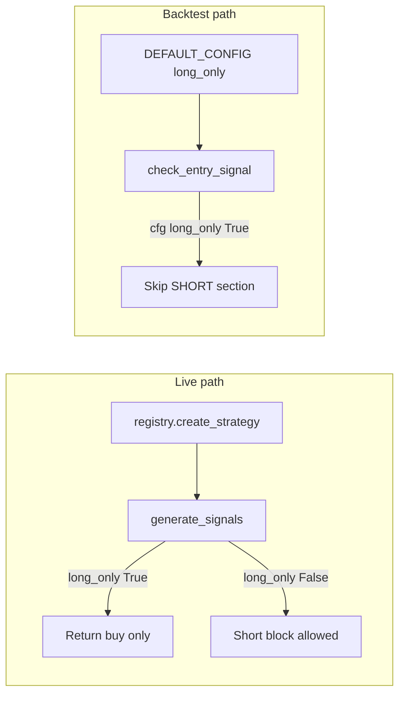

# Plan: Long-Only Enforcement Across All Strategies

## Verification of Pre-Flight Claims

### volatility_breakout

| PRE_FLIGHT claim | Verified? | Evidence |
|---|---|---|
| No `long_only` in Config | **Confirmed** | [`research/strategies/volatility_breakout/config.py`](research/strategies/volatility_breakout/config.py) — `VolatilityBreakoutConfig` ends at line 78 with no direction field |
| No `long_only` in backtest dict | **Confirmed** | [`backtest.py`](backtest.py) `VOLATILITY_BREAKOUT_DEFAULT_CONFIG` lines 241–271 — no key |
| Backtest implicit long-only | **Confirmed** | `check_volatility_breakout_entry_signal` docstring line 1360 ("long only"); only return path is `side="long"` at lines 1500–1511; no short branch |
| Live can short | **Confirmed** (PRE_FLIGHT said "Unknown") | [`strategy.py`](research/strategies/volatility_breakout/strategy.py) lines 551–574: `breakout_direction == 'short'` → `side = "sell"`; `_detect_breakout` returns `'short'` at line 269; `evaluate()` line 684: `signal_type = "BUY" if direction == 'long' else "SELL"` |

**Discrepancy:** PRE_FLIGHT table marks live shorts as "Unknown"; code clearly allows live and screener shorts today.

---

### htf_trend

| PRE_FLIGHT claim | Verified? | Evidence |
|---|---|---|
| No `long_only` in Config | **Confirmed** | [`research/strategies/htf_trend/config.py`](research/strategies/htf_trend/config.py) — no direction field (has `reversal_close_position_short` for short candle quality only) |
| No `long_only` in backtest dict | **Confirmed** | [`backtest.py`](backtest.py) `HTF_TREND_DEFAULT_CONFIG` lines 297+ — no key |
| Backtest implicit long-only | **Confirmed** | `check_htf_trend_entry_signal` docstring line 1525 ("long only"); requires price above EMA200 (lines 1569–1574); always `side="long"` at 1641–1652; no bearish/short entry path |
| Live can short | **Confirmed** | [`strategy.py`](research/strategies/htf_trend/strategy.py) lines 394–408: `trend_direction != 'bullish'` → `side = "sell"`; `evaluate()` lines 550–551: `"BUY" if trend_direction == "bullish" else "SELL"` |

**Discrepancy:** None on substance; PRE_FLIGHT is accurate.

---

### meanrev

| PRE_FLIGHT claim | Verified? | Evidence |
|---|---|---|
| No `long_only` in Config | **Confirmed** | [`research/strategies/meanrev/config.py`](research/strategies/meanrev/config.py) — `MeanReversionConfig` has overbought thresholds but no `long_only` |
| No `long_only` in backtest dict | **Confirmed** | [`backtest.py`](backtest.py) `MEANREV_DEFAULT_CONFIG` lines 152–178 — no key |
| Backtest implicit long-only | **Confirmed** | `check_meanrev_entry_signal` docstring line 1253 ("long only"); only oversold long logic; `side="long"` at 1335–1346 |
| Live can short | **Confirmed** | [`strategy.py`](research/strategies/meanrev/strategy.py) lines 260–309: overbought → `side="sell"`; `evaluate()` line 538: `"BUY" if direction == "bullish" else "SELL"` when ranging |

**Discrepancy:** None.

---

### Cross-cutting (already fixed: vwap_meanrev)

Reference pattern in [`research/strategies/vwap_meanrev/config.py:86`](research/strategies/vwap_meanrev/config.py), [`backtest.py:117`](backtest.py), [`strategy.py:694-695`](research/strategies/vwap_meanrev/strategy.py), [`strategy.py:981-982`](research/strategies/vwap_meanrev/strategy.py), [`backtest.py:995-996`](backtest.py).

Pipeline/single-symbol backtests already pass `cfg.get("long_only", True)` at lines 3103 and 3260; VB/HTF/meanrev ignore that key today because their entry functions never read it.

---

## Per-Strategy Fix Plan

### volatility_breakout

- **Config change:** Add to `VolatilityBreakoutConfig` in [`research/strategies/volatility_breakout/config.py`](research/strategies/volatility_breakout/config.py):
  ```python
  long_only: bool = True  # Permanently disable short signals; bot is long-only by design
  ```
  Place after `atr_period` / before monitor fields (mirror vwap_meanrev layout).

- **strategy.py change:**
  - **`generate_signals`** — After the long retest branch succeeds (or when `breakout_direction != 'long'`), before building short `TradeIntent` (currently lines 551–574): if `self.config.long_only`, clear breakout state and `return None` (same early-exit style as vwap line 694).
  - **`evaluate`** — Line 684: only emit `SELL` when `not self.config.long_only`; otherwise treat short breakout as `NONE` (mirror vwap `evaluate` short scoring gate at 981–982).

- **backtest.py change:**
  - Add `"long_only": True` to `VOLATILITY_BREAKOUT_DEFAULT_CONFIG` (after `btc_ema_period` block ~line 270).
  - **`check_volatility_breakout_entry_signal`:** **none needed** — already long-only by implementation; no short branch to gate. Config key documents contract and keeps pipeline `cfg.get("long_only", True)` consistent for future edits.

- **Live behavior impact:** **Yes.** Runner calls `generate_signals` ([`backend/runner/service.py:369`](backend/runner/service.py)). Shadow bot will stop opening short volatility-breakout entries. Screener may stop surfacing `SELL` grades for VB pairs. Backtest sweep metrics unchanged.

---

### htf_trend

- **Config change:** Add to `HTFTrendConfig` in [`research/strategies/htf_trend/config.py`](research/strategies/htf_trend/config.py):
  ```python
  long_only: bool = True  # Permanently disable short signals; bot is long-only by design
  ```
  Place near other direction-related fields (e.g. after `reversal_close_position_short` or before `require_btc_bull_market`).

- **strategy.py change:**
  - **`generate_signals`** — Before the `else:  # bearish` block (line 394): `if self.config.long_only: return None` after bullish path fails (or gate entire bearish branch).
  - **`evaluate`** — Lines 550–551: when `long_only`, only assign `signal_type = "BUY"` for bullish confirmed setups; never `"SELL"`.

- **backtest.py change:**
  - Add `"long_only": True` to `HTF_TREND_DEFAULT_CONFIG`.
  - **`check_htf_trend_entry_signal`:** **none needed** (implicit long-only, lines 1525–1652).

- **Live behavior impact:** **Yes.** Bearish HTF trend pullbacks that today emit `side="sell"` will stop. This is the highest-risk strategy for “lost trades the user might have wanted” because bearish logic is fully implemented live but never backtested.

---

### meanrev

- **Config change:** Add to `MeanReversionConfig` in [`research/strategies/meanrev/config.py`](research/strategies/meanrev/config.py):
  ```python
  long_only: bool = True  # Permanently disable short signals; bot is long-only by design
  ```
  Place after `strategy_id` or in a “Direction constraint” section like vwap.

- **strategy.py change:**
  - **`generate_signals`** — After buy block (returns ~258), before sell block (line 260): `if self.config.long_only: return None` (vwap pattern).
  - **`evaluate`** — Line 538: `signal_type = "BUY" if direction == "bullish" else ("SELL" if not self.config.long_only else "NONE")` when `is_ranging`.

- **backtest.py change:**
  - Add `"long_only": True` to `MEANREV_DEFAULT_CONFIG`.
  - **`check_meanrev_entry_signal`:** **none needed** (implicit long-only, lines 1253–1346).

- **Live behavior impact:** **Yes.** Overbought mean-reversion shorts (`side="sell"`) stop in runner and screener. Backtest unchanged.

---

## Order of Operations

Smallest safe commits (avoid transient broken state):

1. **Contract commit (no live behavior change):** For all three strategies in one commit:
   - Add `long_only: bool = True` to each Config dataclass.
   - Add `"long_only": True` to `VOLATILITY_BREAKOUT_DEFAULT_CONFIG`, `HTF_TREND_DEFAULT_CONFIG`, and `MEANREV_DEFAULT_CONFIG` in [`backtest.py`](backtest.py).
   - *Why first:* New field defaults to `True`; no code reads it yet → tests and live behavior unchanged; backtest entry functions still long-only.

2. **Live/screener enforcement commit:** For all three `strategy.py` files in one commit:
   - Gate `generate_signals` short paths.
   - Gate `evaluate()` `SELL` paths.
   - *Why second:* Gates read `self.config.long_only` which now exists with correct default.

3. **Optional follow-up (separate, only if user approves):** Unit tests for default `long_only=True` never returning sell; registry fixture `long_only` in test configs (like `PULLBACK_VWAP_CONFIG` at [`backend/tests/test_strategy_registry.py:138`](backend/tests/test_strategy_registry.py)).

**Do not** add dead gates inside `check_*_entry_signal` unless a short branch is added later; vwap’s gate exists because `check_entry_signal` has a SHORT section (lines 994–1007).

**CLI:** `--no-long-only` already merges into `cfg["long_only"]` via `_merge_vwap_cli_overrides` (lines 2781–2782) for all strategies using those dicts — only vwap backtest shorts honor it today. After this fix, live strategies would need `long_only=False` in DB `parameters` to re-enable shorts (dataclass + registry flattening); backtest VB/HTF/meanrev still have no short simulation unless backtest code is extended.

---

## Tests Affected

| File | Test / area | Prediction after fix |
|---|---|---|
| [`research/strategies/meanrev/tests/test_strategy.py`](research/strategies/meanrev/tests/test_strategy.py) | `test_sell_signal_overbought` (lines 253–287) | **Likely no failure** if sell path never triggers on synthetic data; if it does trigger, **will fail** (expects `side=="sell"` with default config). **Flag only — do not “fix” per brief** unless user opts in. |
| [`research/strategies/meanrev/tests/test_strategy.py`](research/strategies/meanrev/tests/test_strategy.py) | `test_strategy_initialization_*`, buy signal tests | **Pass** — new field has default; buy logic unchanged |
| [`backend/tests/test_strategy_registry.py`](backend/tests/test_strategy_registry.py) | VB / HTF / meanrev factory tests | **Pass** — extra dataclass field ignored by existing assertions |
| [`backend/tests/test_runner_multi_strategy.py`](backend/tests/test_runner_multi_strategy.py) | Runner wiring | **Pass** — no sell assertions |
| [`backend/tests/test_shadow_execution_gates.py`](backend/tests/test_shadow_execution_gates.py) | D2 gates | **Pass** |
| [`backend/tests/test_pipeline_d2_gate.py`](backend/tests/test_pipeline_d2_gate.py) | D2 exempt meanrev | **Pass** |
| HTF / VB strategy tests | *(none beyond empty `__init__.py` packages)* | N/A |
| [`research/strategies/vwap_meanrev/tests/test_strategy.py`](research/strategies/vwap_meanrev/tests/test_strategy.py) | — | **Pass** — out of scope |
| [`backend/tests/test_backtest_binance_mapping.py`](backend/tests/test_backtest_binance_mapping.py) | Symbol mapping | **Pass** |
| Pipeline/backtest integration tests | — | **None exist** for VB/HTF/meanrev entry |

No test currently asserts pipeline backtest produces shorts for VB/HTF/meanrev (PRE_FLIGHT correct: backtests were never short-contaminated).

---

## Rollback Plan

**If shadow bot misbehaves after deploy:**

1. Identify commits (expected: contract commit + enforcement commit).

2. **Minimal revert (preserves vwap_meanrev fix):**
   ```bash
   # Revert only the live-gating commit (strategy.py changes)
   git revert <enforcement-commit-sha> --no-edit
   ```
   Live shorts return; Config `long_only=True` remains but unused until gates restored.

3. **Full revert of this initiative (still keep vwap backtest fix):**
   ```bash
   git revert <enforcement-commit-sha> <contract-commit-sha> --no-edit
   ```
   Or checkout pre-change versions of only:
   - `research/strategies/volatility_breakout/{config,strategy}.py`
   - `research/strategies/htf_trend/{config,strategy}.py`
   - `research/strategies/meanrev/{config,strategy}.py`
   - Remove `"long_only"` lines from `VOLATILITY_BREAKOUT_DEFAULT_CONFIG`, `HTF_TREND_DEFAULT_CONFIG`, `MEANREV_DEFAULT_CONFIG` in `backtest.py` **only** (leave `DEFAULT_CONFIG["long_only"]` for vwap untouched).

4. **Redeploy:** rsync + `docker compose up --build -d` per [`PROJECT_CONTEXT.md`](PROJECT_CONTEXT.md).

5. **Do not** revert [`backtest.py`](backtest.py) `DEFAULT_CONFIG` / `check_entry_signal` vwap gates unless intentionally undoing vwap fix.

---

## Risk Assessment

| Strategy | Severity | Likelihood of unwanted behavior change | Notes |
|---|---|---|---|
| **volatility_breakout** | Medium | Low–medium | Short breakouts are coded but may be rare in shadow. Backtest P&amp;L unchanged. User loses any live short VB trades they relied on. |
| **htf_trend** | **High** | Medium | Largest divergence: full bearish path in live, zero in backtest. Fixing aligns live to validated backtest — correct for stated long-only design, but any shadow short HTF trades disappear. |
| **meanrev** | Medium | Low–medium | Sell path exists; meanrev is D2-exempt and often runs in ranging markets — overbought shorts may have occurred. Backtest numbers stay valid. |

**Overall:** This fix **reduces** risk vs status quo (live taking trades backtest never simulated). Residual risk is operational: fewer signals → lower shadow trade count short term.

**Screener-only impact:** `evaluate()` SELL suppression may change pair rankings/confidence displays even when runner would not have traded — intentional parity with long-only design.

---

## Open Questions

1. **Opt-in shorts:** Should `--no-long-only` (backtest) and DB `parameters.long_only: false` be officially supported for VB/HTF/meanrev, given backtest entry functions cannot simulate shorts without new backtest code?

2. **Unit tests:** Add per-strategy tests that `generate_signals` never returns `sell` with default config (and `evaluate` never `SELL`)? User must approve new test code.

3. **`test_sell_signal_overbought`:** Keep as documentation of short logic with `MeanReversionConfig(long_only=False)`, or leave failing/ flaky? Brief says flag, not fix.

4. **DB seed / supervisor configs:** Should Postgres strategy JSONB rows explicitly set `"long_only": true` under `parameters`, or rely on dataclass defaults via registry?

5. **HTF `evaluate` bearish scoring:** With `long_only=True`, bearish direction may still add confidence without `SELL` — is that acceptable for screener UX, or should bearish scoring be suppressed entirely?

6. **Momentum strategy:** [`research/strategies/momentum/config.py:67`](research/strategies/momentum/config.py) already has `long_only`; not in scope but same audit may apply if momentum is re-enabled.

---

## Reference: vwap_meanrev pattern (do not re-break)



For VB/HTF/meanrev after this plan: **live** matches **backtest** (long-only); config flag documents the contract; backtest needs no SHORT section.
